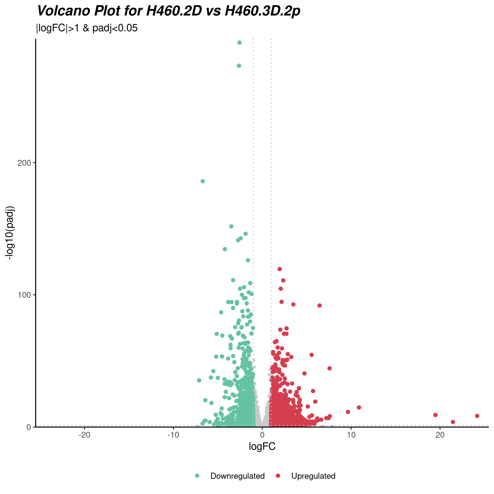
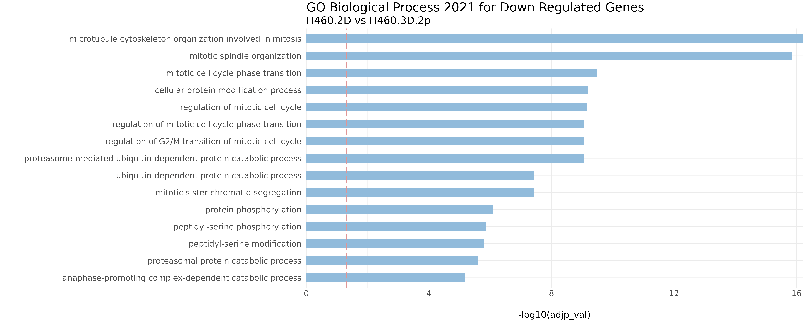
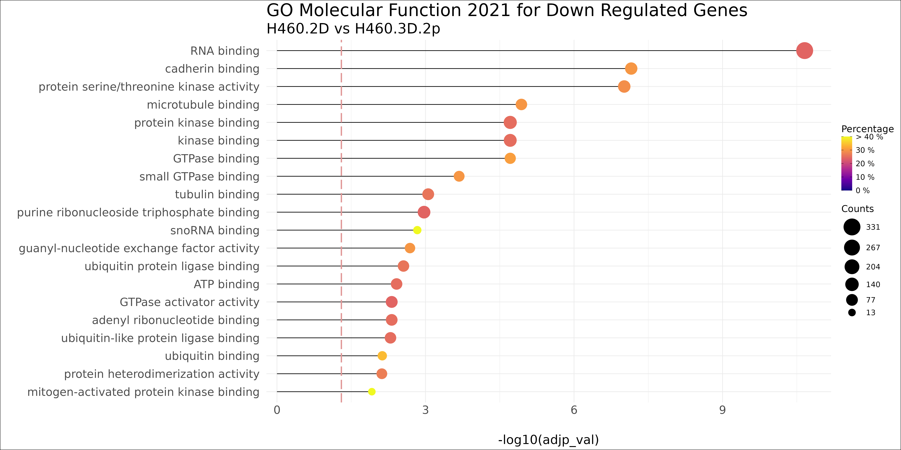
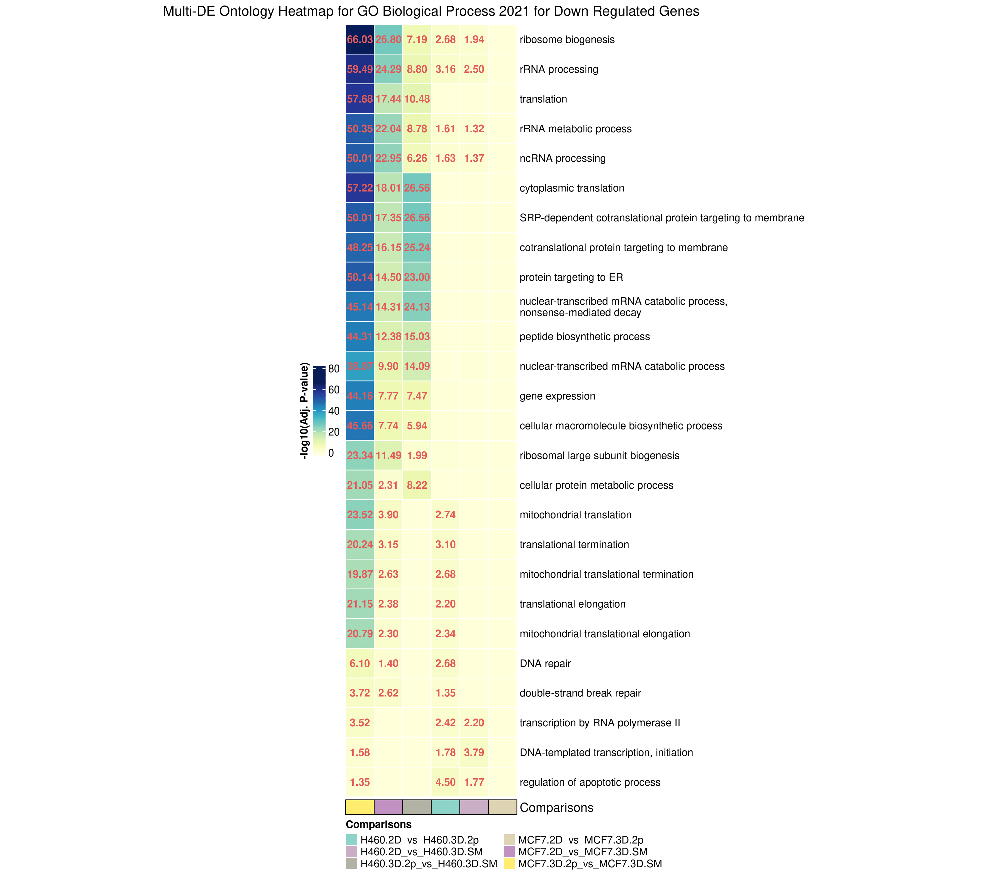
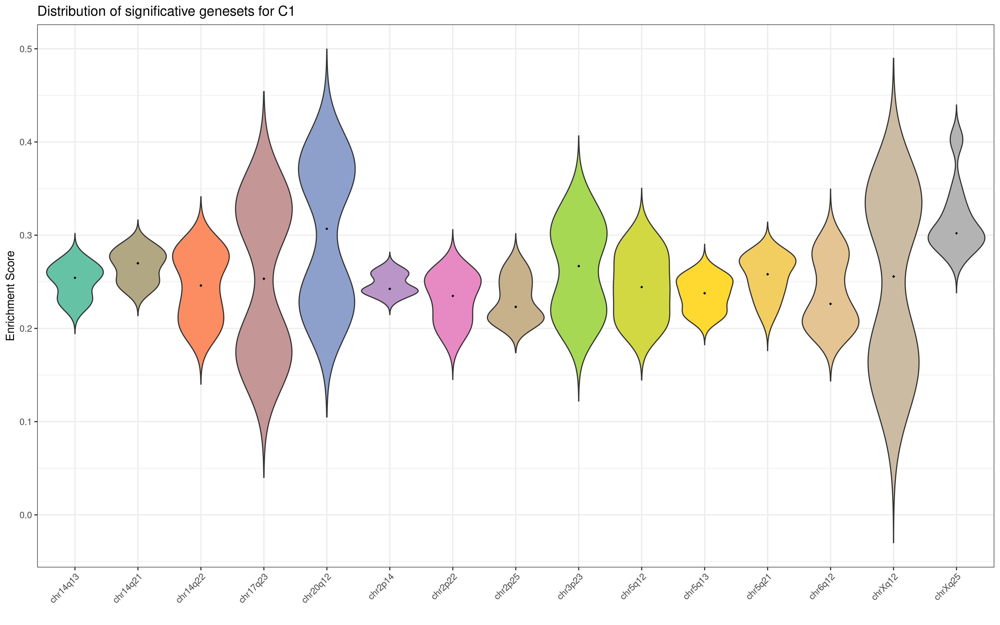
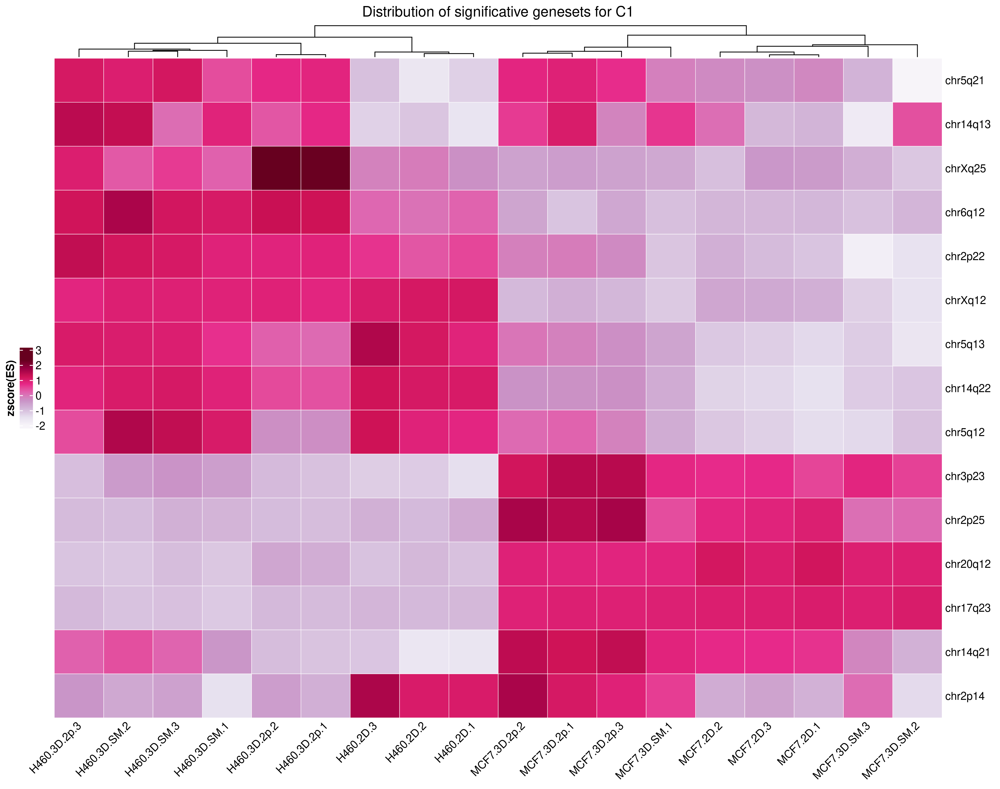
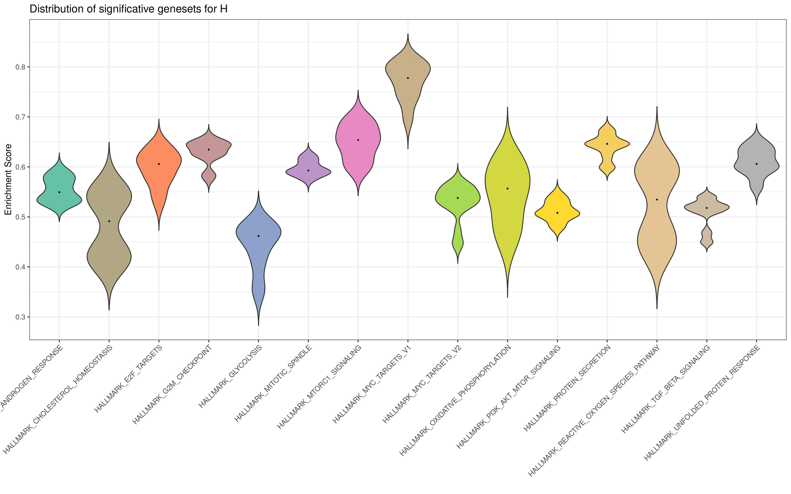
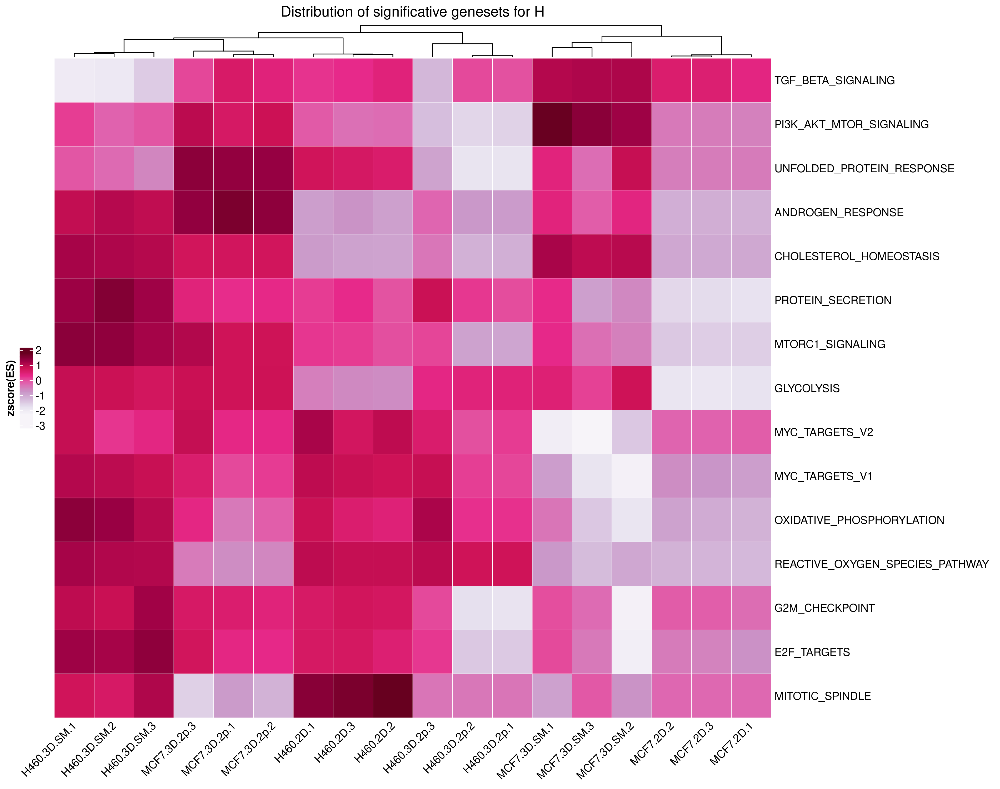

```{r setup_package, include=FALSE}
knitr::opts_chunk$set(echo = T, error = TRUE, eval = F)
```

## Introduction

This tutorial provides a walk through on how to use AutoGO to perform Functional Enrichment Analysis from gene lists or directly from raw counts performing Differential Expression Analysis.

The AutoGO package is structured in different, independent functions, in order to let the user decide which steps of the whole analysis to perform and which visualizations to produce, even if it is suggested to perform the whole workflow: Differential Expression Analysis; Volcano Plot; Functional Enrichment Analysis on databases chosen by the user; Visualization of the enrichment results with Barplot, Lollipop and Heatmap;

## Installation

```{r, message=FALSE, warning=FALSE}
library(devtools)
install_github("mpallocc/auto-go", ref="develop")
#install.packages("autoGO")
library(autoGO)
```


## Loading data

Loading example data to run the whole tutorial.
```{r, message=FALSE, warning=FALSE}
data(counts, groups, comparisons)
```


## Differential Gene Expression

```{r}
deseq_analysis(counts,
               groups,
               comparisons,
               padj_threshold = 0.05,
               log2FC_threshold = 0,
               pre_filtering = T,
               save_excel = F,
               outfolder = "./results",
               del_csv = ",")
```

#### Parameters:

* *counts*: path to raw counts file or a dataframe.

* *groups*: it is the sample information table needed by DESeq2, constituted by the column *sample*, including sample barcodes and by the column *group* including the condition to which each sample belongs. It can be provided as a .txt file or as a dataframe.

* *comparisons*: it is the comparison table needed by DESeq2, constituted by the column *treatment* and by the column *control*. It can be provided as a .txt file or as a dataframe.

```{r, echo=FALSE, eval=TRUE}
groups <- data.frame(sample=c("sample_1", "sample_2", "sample_3", "sample_4", "sample_5", "sample_6"),
                     group=c("CTRL", "CTRL", "TREAT_A", "TREAT_A", "TREAT_B", "TREAT_B"))

comparisons <- data.frame(treatment = c("TREAT_A", "TREAT_B", "TREAT_A"),
                          control = c("CTRL", "CTRL", "TREAT_B"))
knitr::kable(list(groups, comparisons), booktabs = TRUE, valign = 't', caption = "Groups and comparisons example tables")
```

* *padj_threshold* and *log2FC_threshold*: Defaults are padj_threshold = 0.05, log2FC_threshold = 0.

* *pre_filtering*: it removes the genes which sum along the samples in the raw counts is less than 10.

* *save_excel*: if True it allows to save all the output tables in .xlsx format. Default False.

* *outfolder* : the name of the output folder. Default is: "./results". (NOTE: The outfolder chosen by the user will be the parent folder of the results. Inside this, the subfolders will be organized following the autoGO structure in order to keep the results of the downstream analysis ordered.)

* *del_csv* : the delimiter of the counts file. Default is ",".


## Filtering DESeq2 results

It allows to filter the Differential Expression Analysis results with the new filters directly from the complete output table "*_allres.tsv" without repeating the whole analysis.

```{r}
filtering_DE(padj_threshold = 0.05,
             log2FC_threshold = 1,
             outfolder = "./results",
             save_excel = F)
```

* *padj_threshold* and *log2FC_threshold*: Defaults are padj_threshold = 0.05, log2FC_threshold = 1.

* *outfolder* : the name of the output folder. Default is: "./results". (NOTE: The outfolder chosen by the user will be the parent folder of the results. Inside this, the subfolders will be organized following the autoGO structure in order to keep the results of the downstream analysis ordered.)

* *save_excel*: if True it allows to save all the output tables in .xlsx format. Default False.


## Volcano Plot

Volcano plot of specific comparisons of the differential analysis results.

```{r}
filename <- "./results/H460.2D_vs_H460.3D.2p/DE_H460.2D_vs_H460.3D.2p_allres.tsv"
volcanoplot(DE_results = filename,
            my_comparison = "H460.2D_vs_H460.3D.2p",
            log2FC_thresh = 0,
            padj_thresh = 0.05,
            highlight_genes = c("TFPI", "PROS1"),
            del_csv = ",",
            outfolder = "./results")

filename <- "./results/H460.2D_vs_H460.3D.2p/DE_H460.2D_vs_H460.3D.2p_allres.tsv"
volcanoplot(DE_results = filename,
            my_comparison = "H460.2D_vs_H460.3D.2p",
            log2FC_thresh = 1,
            padj_thresh = 0.05,
            highlight_genes = NULL,
            del_csv = ",",
            outfolder = "./results")
```

```{r, fig.show='hold', echo=FALSE, out.width = '47%',  eval=TRUE} 


```

#### Parameters:

* *DE_results*: output table of the differential analysis. It can be provided as a file (.tsv, .csv, tab-separated .txt) or a dataframe. It is necessary that the columns *genes*, *log2FoldChange* and *padj* are present.

* *my_comparison*: the comparison of the differential analysis the user would like to plot (following the structure from the comparison file: control_vs_treatment, a_vs_b)

* *padj_thresh* and *log2FC_thresh*: Defaults are padj_thresh = 0.05, log2FC_thresh = 0.

* *highlight_genes*: a list of genes the user would like to highlight in the volcano plot. It accepts a dataframe, a character vector or a path to a file .txt format.

* *outfolder* : the name of the output folder. Default is: "./results". (NOTE: The outfolder chosen by the user will be the parent folder of the results. Inside this, the subfolders will be organized following the autoGO structure in order to keep the results of the downstream analysis ordered.)

* *del_csv* : default is ",".


If the user had more conditions in the Differential Analysis, there will be many comparisons, so it is possible to apply the following structure to realize the volcano plots for all the comparisons of the analysis:

```{r}
all_path_res <- list.files(path = "./results", pattern = "_allres.tsv", recursive = T, full.names = T)
res_lists <- lapply(all_path_res, function (x) read_tsv(x, col_types = cols()))
names(res_lists) <- gsub("results/|/DE_.*", "", all_path_res)

invisible(lapply(names(res_lists), function (i) volcanoplot(res_lists[[i]], my_comparison = i)))
```

## Choose of database
It allows to search over all the Enrichr databases on which it is possible to perform the Enrichment Analysis. In this way the user is able to select only the databases for which he wants to perform downstream analysis.

```{r}
choose_database(db_search = "KEGG")
```

#### Parameters:
* *dbs_search*: allows to restrict the research for a string pattern (i.e. "GO", "KEGG", "TF") in order to return a smaller set on which to choose, based on a pattern in the name of the databases.


## Reading gene lists

It is employed to load in a variable all the gene lists the user would like to enrich without having to repeat several times the enrichment. It is necessary to call this function if the user is passing more than one list of genes.
In the case in which also the previous steps of autoGO have been performed (*from_autoGO = T*) it is not necessary to pass other parameters rather than the *gene_lists_path* to the function, all the other information will be taken from the path of the gene lists.


```{r}
gene_lists_path <- "./results"
gene_lists <- read_gene_lists(gene_lists_path = gene_lists_path,
               log2FC_threshold = 0,
               padj_threshold = 0.05,
               which_list = "down_genes",
               from_autoGO = T,
               files_format = NULL)
names(gene_lists)
```

#### Parameters:

* *gene_list_path* : Folder in which the gene lists are contained.

* *padj_threshold* and *log2FC_threshold*: Defaults are padj_threshold = 0.05, log2FC_threshold = 0.

* *which_list*: *"up_genes"*,*"down_genes"*,*"up_down_genes"* or *"everything"*. The list of genes the user would like to enrich. Respectively, both up and down regulated genes (up_down_genes), only up regulated genes (up_genes), only down regulated genes (down_genes). While *"everything"* allows to load all the three kind of lists separately or lists not from differential analysis.

* *from_autoGO* : set FALSE if the previous steps from autoGO have not been performed. Default is TRUE.

* *files_format* : when from_autoGO is FALSE it is mandatory to provide the extension of the list of genes you want to upload. Default is NULL.


## Enrichment analysis

Each desired gene list is enriched on all the databases chosen by the user (see choose_database). The function will produce the enrichment table for each chosen database.

```{r}
autoGO(list_of_genes = gene_lists,
      dbs = c("GO_Molecular_Function_2021", "GO_Biological_Process_2021", "KEGG_2021_Human"),
      my_comparison = NULL,
      ensembl = F,
      excel = F,
      outfolder = "./results")
```


#### Parameters:

* *list_of_genes*: it can be a list of dataframe containing gene list (i.e. the output of *read_gene_lists.R*), a vector of genes or a single dataframe containing the gene list or the path to a .txt file.

* *dbs*: databases for which the enrichment will be performed (see choose_database) Default are *GO_Molecular_Function_2021*, *GO_Biological_Process_2021*, *KEGG_2021_Human*.

* *my_comparison*: the comparison of the differential analysis the user would like to plot (following the structure from the comparison file: control_vs_treatment, a_vs_b), or the name the user would like to give to the analysis.

* *ensembl*: Set TRUE if the provided gene list contains Ensembl IDs. A conversion to HGNC will be performed. Default is FALSE.

* *excel*: if True it allows to save all the output tables in .xlsx format. Default False.

* *outfolder* : the name of the output folder. Ignored if list_of_genes is a list. Default is NULL. (NOTE: The outfolder chosen by the user will be the parent folder of the results. Inside this, the subfolders will be organized following the autoGO structure in order to keep the results of the downstream analysis ordered.)

It is possible to perform the Enrichment Analysis also on a single gene list. It is anyway suggested to employ the read_gene_list function.

```{r}
autoGO(list_of_genes = gene_lists[[1]],
      dbs = c("GO_Molecular_Function_2021", "GO_Biological_Process_2021", "KEGG_2021_Human"),
      my_comparison = "my_comparison_2025",
      ensembl = F,
      excel = F,
      outfolder = "./results")
```


## Reading enrichment tables

It is employed to load in a variable all the enrichment tables the user would like to subsequently plot without having to load them several times. It is necessary to call this function if the user is passing more than one enrichment table.
In the case in which also the previous steps of autoGO have been performed (*from_autoGO = T*) it is not necessary to pass other parameters to the function rather than the *enrich_table_path*, all the other information will be taken from the path of the enrichment tables.

```{r}
enrich_table_path <- "./results"
enrich_tables <- read_enrich_tables(
                  enrich_table_path = enrich_table_path,
                  log2FC_threshold = 0,
                  padj_threshold = 0.05,
                  which_list = "down_genes",
                  from_autoGO = T,
                  files_format = NULL)
names(enrich_tables)
```

#### Parameters:

* *enrich_table_path* : Folder in which the enrichment tables are contained (or the parent folder in case from_autoGO = T).

* *padj_threshold* and *log2FC_threshold*: Defaults are padj_threshold = 0.05, log2FC_threshold = 0.

* *which_list* = *"up_genes"*,*"down_genes"*,*"up_down_genes"* or *"everything"*. The tables of the results the user would like to plot. Respectively, based on the enriched list, both up and down regulated genes (up_down_genes), only up regulated genes (up_genes), only down regulated genes (down_genes). While *"everything"* allows to load the results of all the three kind of lists separately or the results of lists not from differential analysis.

* *from_autoGO* : set FALSE if the previous steps from autoGO have not been performed. Default is TRUE.

* *files_format* : when from_autoGO is FALSE it is mandatory to provide the extension of the enrichment tables you want to upload. Default is NULL.


## Visualization:

Auto-GO allows the user to visualize the enrichment results with different kind of plots produced in an automated way. The barplot and the lollipop plot of the most enriched terms of each list and the heatmap of the most enriched terms along all the enriched lists.


## Barplot

It produces a barplot of the 15 most enriched term for each desired enrichment table.
In the case in which also the previous steps of autoGO have been performed (*from_autoGO = T*) it is not necessary to pass *title*, *outfolder* and *outfile*, all the information will be taken from the path of the gene lists.

```{r}
barplotGO(enrich_tables = enrich_tables,
          title = NULL,
          outfolder = NULL,
          outfile = NULL,
          from_autoGO = TRUE)
```


```{r, echo=FALSE, out.width = '98%', eval=TRUE} 

```

It is possible to produce a Barplot also on a single enrichment table. It is anyway suggested to employ the *read_enrich_table* function.


```{r}
enrich_table <- enrich_tables[[1]]
barplotGO(enrich_tables = enrich_table,
          title = c("Title of my barplot", "and subtitle"),
          outfolder = "./results/my_comparison_2025/enrichment_plots",
          outfile = "barplot_myDB.png",
          from_autoGO = FALSE)
```

#### Parameters:

* *enrich_tables* : it can be a list of dataframe containing erichment tables (i.e. the output of *read_enrich_tabke.R*), a single dataframe containing the enrichment results or the path to a file. Columns 'Term' and 'Adjusted.P.Value' are required.

* *title* : Default NULL. If from_autoGO is TRUE, *title* must be NULL. When enrichment tables are not from autoGO and thus from read_enrich_tables, the user must specify title and subtitle of the plot as 2-element character vector: c("This is the title", "this is the subtitle")

* *outfolder* : Default NULL. If from_autoGO is TRUE, *outfolder* must be NULL. When enrichment tables are not from autoGO and thus from read_enrich_tables, the user must specify *outfolder*. (NOTE: The outfolder chosen by the user will be the parent folder of the results. Inside this, the subfolders will be organized following the autoGO structure in order to keep the results of the different analysis ordered.)

* *outfile* : The name of the file containing the plot. Default "barplotGO.png". If from_autoGO is TRUE, it is ignored.

* *from_autoGO* : set FALSE if the previous steps from autoGO have not been performed. Default is TRUE.


## Lollipop

It produces a lolliplot of the 20 most enriched term for each desired enrichment table.
In the case in which also the previous steps of autoGO have been performed (*from_autoGO = T*) it is not necessary to pass *title* and *outfolder*, all the information will be taken from the path of the gene lists.

```{r}
lolliGO(enrich_tables = enrich_tables,
        title = NULL,
        outfolder = NULL,
        outfile = NULL,
        from_autoGO = TRUE)
```

```{r, echo=FALSE, out.width = '98%', eval=TRUE} 

```


It is possible to produce a lolliplot also on a single enrichment. It is anyway suggested to employ the *read_enrich_table* function.

```{r}
enrich_table <- enrich_tables[[1]]
lolliGO(enrich_tables = enrich_table,
        title = c("Title of my barplot", "and subtitle"),
        outfolder = "./results/my_comparison_2023/enrichment_plots",
        outfile = "lolli_myDB.png",
        from_autoGO = FALSE)
```

#### Parameters:

* *enrich_tables* : it can be a list of dataframe containing erichment tables (i.e. the output of *read_enrich_tabke.R*), a single dataframe containing the enrichment results or the path to a file. Columns 'Term' and 'Adjusted.P.Value' are required.

* *title* : Default NULL. If from_autoGO is TRUE, it must be NULL. When enrichment tables are not from autoGO and thus from read_enrich_tables, the user must title and subtitle of the plot as 2-element character vector: c("This is the title", "this is the subtitle")

* *outfolder* : Default NULL. If from_autoGO is TRUE, it must be NULL. This is the name of the output folder. (NOTE: The outfolder chosen by the user will be the parent folder of the results. Inside this, the subfolders will be organized following the autoGO structure in order to keep the results of the different analysis ordered.)

* *outfile* : The name of the file containing the plot. Default "lolliGO.png". If from_autoGO is TRUE, it is ignored.

* *from_autoGO* : set FALSE if the previous steps from autoGO have not been performed. Default is TRUE.


## HeatmapGO

If the enrichemnt analysis have been performed on many comparisons (or gene lists) it is interesting to have a look at the enrichment results over all these gene lists together.

The function automatically reads all the enrichment tables of the chosen database (if the previous steps of autoGO have been performed. In this case it is mandatory). It produces a heatmap of the most enriched terms over a certain number of comparison (or enriched lists). The user can choose the minimum of comparisons on which a certain term must be significant (i.e. if the user has 5 comparisons it is possible to look at terms significant over all the comparison using *min_term_per_row = 5*).

```{r}
heatmapGO(db = "GO_Biological_Process_2021",
          outfolder = "./results",
          log2FC_threshold = 0,
          padj_threshold = 0.05,
          min_term_per_row = 3,
          which_list = "down_genes")
```

#### Parameters:

* *db*: database for which the user would like to produce the heatmap. It has to be one for which the enrichment analysis has been performed.

* *outfolder*: the name of the output folder used until now. The enrichment tables will be searched inside of it. Default is: "./results". (NOTE: The outfolder chosen by the user will be the parent folder of the results. Inside this, there will be created a folder called comparison_heatmap).

* *padj_threshold* and *log2FC_threshold*: Default are *padj_treshold* = 0.05 and *log2FC_threshold* = 0

* *min_term_per_row*: Minimum of comparisons or enriched lists on which a certain term must be significant (Defaults to 2).

* *which_list*: "up_genes", "down_genes","up_down_genes" or "not_from_DE". It allows to choose which enrichment results to plot based on the kind of enriched lists. Respectively, enrichment on both up and down regulated genes (up_down_genes), only up regulated genes (up_genes), only down regulated genes ("down_genes") or select "not_from_DE" if your enrichment is made on a list of genes that does not come from a differential expression analysis.


```{r, echo=FALSE, out.width = '80%', fig.align='center', eval=TRUE} 

```


For a faster process it is possible to define a vector containing the employed database and produce the heatmap for each of them:

```{r}
dbs <- c("GO_Molecular_Function_2021", "GO_Biological_Process_2021", "KEGG_2021_Human")
lapply(dbs, function (i) heatmapGO(db = i, outfolder = "./results", which_list = "down_genes", min_term_per_row = 3))
```

## Single-sample Gene Set Enrichment Analysis

It is possible to perform a single-sample Gene Set Enrichment Analysis with the function *ssgsea_wrapper.R* . This kind of analysis is recommended when there are too few samples. In the end the analysis will produce an enrichment score for each sample and associated visualizations.


```{r}
ssgsea_wrapper(norm_data = "results/deseq_vst_data.txt",
               gene_id_type = c("gene_symbol"),
               write_enrich_tables = TRUE,
               group = NULL,
               outfolder = "./results/ssgsea",
               full_names = TRUE,
               tpm_norm = FALSE,
               categories = c("C1", "H"))
```

```{r, echo=FALSE, out.width = '98%',  eval=TRUE} 




```

#### Parameters:

* *norm_data*: path of the normalized matrix. By default it is the "deseq_vst_data.txt" computed with the function "deseq_analysis.R". Requirements: first column gene names.

* *gene_id_type*: it is possible to choose among "gene_symbol", "entrez_gene", "ensembl_gene".

* *write_enrich_tables*: default False. Set to True will save the matrix with enrichment scores.

* *outfolder* : Name of the output folder in which to save the results. Default "./ssgsea"

* *full_names* : default FALSE. This parameter regards the visualizations, set to TRUE will plot the full names of the terms inside the plots.

* *categories*: Possible to choose between "C1", "C2", "C3", "C4", "C5", "C6", "C7", "C8", "H", based on Molecular Signatures Database (MSigDB).

